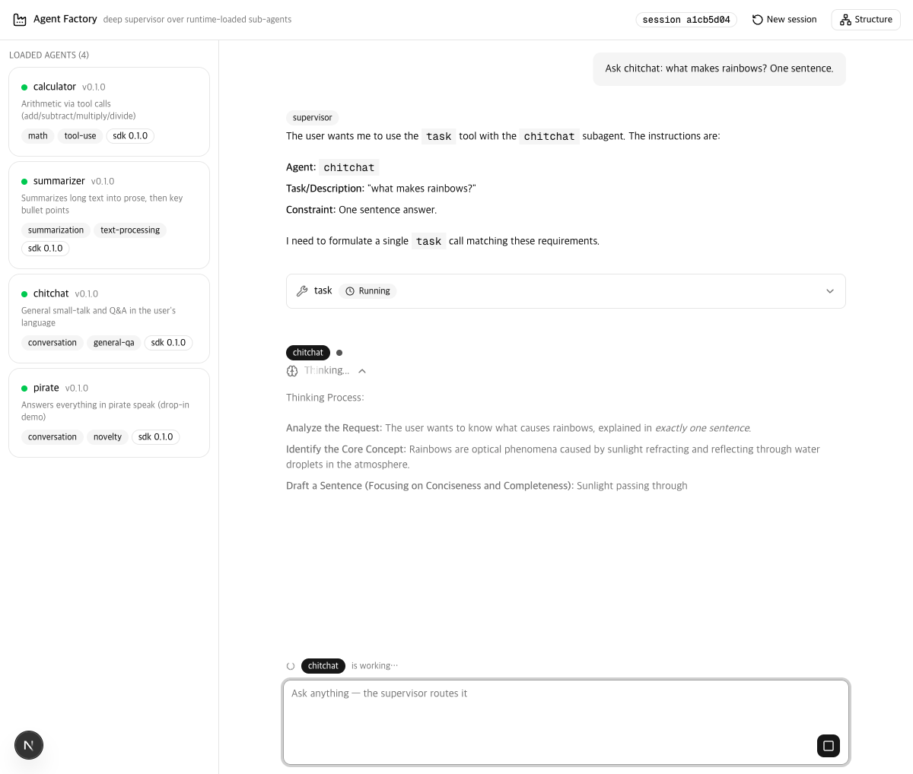
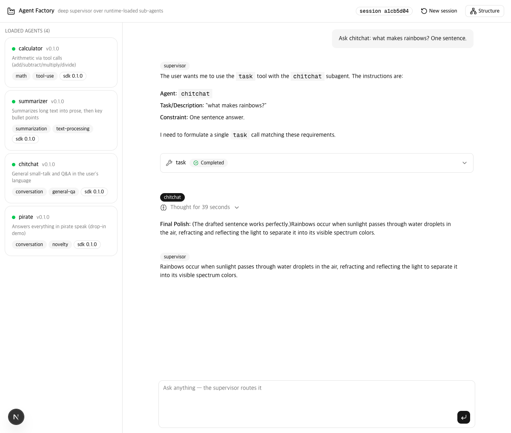

<div align="center">

# jyje/pilot-agent-factory

🏭 표준화된 런타임 로딩 LangGraph 하위 에이전트 패키지 파일럿

[](https://github.com/jyje/pilot-agent-factory)
[](LICENSE)
[](https://github.com/langchain-ai/langgraph)
[](https://www.python.org)

[English](README.md) · [한국어](README-ko.md) · [Docs](docs/README.md)

---

**유용하셨다면 ⭐ 부탁드립니다 — 다른 분들이 찾는 데 도움이 됩니다.**

</div>

## 개요

LangGraph 하위 에이전트를 **표준화된 플러그인 패키지**로 개발하고, 호스트가 빌드 시점에 알지 못해도 런타임에 불러오는 패턴입니다.

```
계약 (SDK) → 패키징 (entry points) → 런타임 로딩 → 수퍼바이저 → Deep 오케스트레이션
  Phase 1       Phase 2                Phase 3      Phase 4      Phase 5
                                           Phase 6 (계획): zip/tar/git import
```

모든 하위 에이전트는 `manifest`(메타데이터 + 라우팅 힌트)와 컴파일된 `StateGraph`를 반환하는 `build()` 팩토리를 노출하는 pip 패키지입니다. 호스트는 두 가지 모드로 에이전트를 탐색합니다:

- **모드 A — entry points**: `agent_factory.agents` 그룹에 등록된 pip 설치 패키지 (기본)
- **모드 B — 드롭인**: 디렉토리에서 런타임에 임포트하는 일반 `.py` 파일 (PVC/ConfigMap 마운트의 로컬 대응물)

깨진 에이전트 하나가 호스트 부팅을 막지 않습니다 — 로딩 실패는 소스별로 격리·보고됩니다. 최상위에는 **deep agent**가 있습니다(Phase 5) — 계획을 세우고 `task` 툴로 로딩된 에이전트에 위임하며(파일시스템 미연결, 하위 에이전트 라우팅 전용), checkpointer로 **멀티턴 세션**을 유지합니다. 플랫폼 구조는 CLI와 웹 양쪽에서 **Mermaid 그래프 뷰**로 볼 수 있습니다.


## 데모 — 로컬 모델 실기 시나리오

모두 LM Studio(`google/gemma-4-e4b`)에서 웹 콘솔로 캡처했습니다. 메시지 사이의 라우팅 칩은 수퍼바이저의 실제 결정(`route_trace`)이 SSE로 스트리밍된 것입니다.

### 1 · 에이전트 간 협업 (한국어 수학)

*"55 더하기 11은 뭔가요?"* — 수퍼바이저가 **calculator**로 라우팅(`add` 툴 실행)한 뒤 **chitchat**에 핸드오프, chitchat이 한국어로 자연스럽게 답합니다("55에 11을 더하면 66이에요 😊"). 어느 쪽에도 특화된 오케스트레이션 코드 없이 두 전문 에이전트가 하나의 요청에 협업합니다.


### 2 · 커스텀 state 채널 (summarizer + artifacts)

요약 요청이 **summarizer**로 라우팅되고, 2노드 파이프라인이 불릿 요약을 응답으로 반환하는 *동시에* `summary` state 채널을 수퍼바이저의 `artifacts`로 승격합니다 — 에이전트의 `output_schema` 선언 그대로 📦 카드로 표시됩니다.


### 3 · 드롭인 에이전트 라우팅 (pirate)

**pirate** 에이전트는 pip 설치된 적이 없습니다 — `dropins/`의 파일 하나입니다. 그래도 라우터는 manifest의 capabilities로 찾아서 선택합니다. 이 실행은 약한 로컬 모델에서의 라우터 완화 경로도 보여줍니다: pirate를 재참조하다가 라우팅 이력 힌트가 FINISH로 이끕니다.


### 4 · 플랫폼 구조 뷰 (Phase 5)

헤더의 **Structure** 버튼(또는 `main.py graph`)이 라이브 토폴로지를 렌더링합니다: deep supervisor가 `task` 엣지로 모든 로딩된 에이전트의 *실제* 컴파일된 그래프 — calculator의 ReAct 루프, summarizer의 2노드 파이프라인 — 에 연결된 모습. 레지스트리에서 생성되므로 import된 에이전트도 그리기 코드 없이 나타납니다.


### 5 · 멀티턴 세션 메모리 (Phase 5)

턴 1: *"My name is Jay."* 턴 2: *"What is my name?"* → **"Jay"** — 모델이 이전 턴을 인용합니다. 대화 상태는 세션 칩의 `thread_id`로 구분되는 checkpointer에 서버 측으로 보관됩니다. 이어서 같은 세션에서 deep agent가 `task` 툴로 계산을 위임합니다.


### 6 · 에이전트별 속성이 달린 토큰 스트리밍

모든 LLM 토큰이 SSE로 실시간 스트리밍되며 생산자가 누구인지 속성이 붙습니다: 버블마다 **에이전트 배지**, 하단에 **지금 일하는 에이전트** 표시, 툴 칩은 Running → Completed로 전환됩니다. 모델의 사고과정은 **열린 Reasoning 폴드**("Thinking…", 첫 캡처) 안에서 스트리밍되다가 스트림이 끝나면 **"Thought for N seconds"로 자동 접힙니다**(두 번째 캡처).




## 구성

| 구성요소 | 역할 |
|--------|------|
| `src/packages/agent-factory-sdk` | 계약(`AgentManifest`, `SubAgent`), semver 호환성 게이트, 로더/레지스트리, 수퍼바이저 조립, **deep 오케스트레이션 + 그래프 렌더링**, 테스트 하니스 |
| `src/packages/agent-chitchat` | 예시 1 — 단일 노드 대화 그래프 |
| `src/packages/agent-calculator` | 예시 2 — ReAct 툴 루프 (사칙연산) |
| `src/packages/agent-summarizer` | 예시 3 — 커스텀 `summary` state 채널을 갖는 2노드 파이프라인 |
| `src/dropins/agent_pirate.py` | 모드 B 데모 — pip 설치 없이 파일에서 직접 로딩 |
| `app/backend` | 플랫폼의 FastAPI 소비자 — `/api/agents`, `/api/chat` (SSE) |
| `app/frontend` | Next.js 16 + AI Elements + shadcn/ui 수퍼바이저 콘솔 |

## 빠른 시작

[LM Studio](https://lmstudio.ai)의 Anthropic 호환 엔드포인트로 완전 로컬 실행 — API 키가 필요 없습니다.

```bash
git clone https://github.com/jyje/pilot-agent-factory.git
cd pilot-agent-factory/src
cp .env.sample .env   # 기본값: LM Studio http://127.0.0.1:1234

uv sync --dev

# 검증: 환경변수, 엔드포인트, 에이전트 탐색, 추론
uv run python doctor.py

# 탐색된 에이전트 목록 (설치 3 + 드롭인 1)
uv run python main.py list

# 에이전트 직접 실행, 또는 deep supervisor에게 위임 맡기기
uv run python main.py run calculator "What is (17 + 25) * 3?"
uv run python main.py chat "What is (17 + 25) * 3?"
uv run python main.py chat            # 멀티턴 REPL (세션 메모리)
uv run python main.py graph           # Mermaid 플랫폼 구조

# LLM 없이 도는 테스트 스위트 (계약 + 로더 + 에이전트 + 수퍼바이저)
uv run pytest
```

### 웹앱 (수퍼바이저 콘솔)

```bash
# 터미널 1 — 백엔드
cd app/backend && uv sync
uv run fastapi dev src/agent_factory_backend/server.py

# 터미널 2 — 프론트엔드
cd app/frontend && pnpm install
pnpm dev      # → http://localhost:3000
```

→ 자세히: [docs/03-webapp-ko.md](docs/03-webapp-ko.md)

LM Studio 설정: tool_use 지원 모델(예: `google/gemma-4-e4b`)을 context ≥16384로 로드하고 REST API v1을 Anthropic-compatible 모드로 — 자세한 내용은 자매 파일럿의 [LM Studio 가이드](https://github.com/jyje/pilot-deepagents-rubrics/blob/main/docs/05-lmstudio-ko.md)를 참고하세요. 공식 Anthropic API 전환은 `.env`만 바꾸면 됩니다.

## 문서

→ [docs/README.md](docs/README.md) — 아키텍처, 계약 명세, 신규 에이전트 작성 방법

## 라이선스

MIT © [jyje](https://github.com/jyje)
