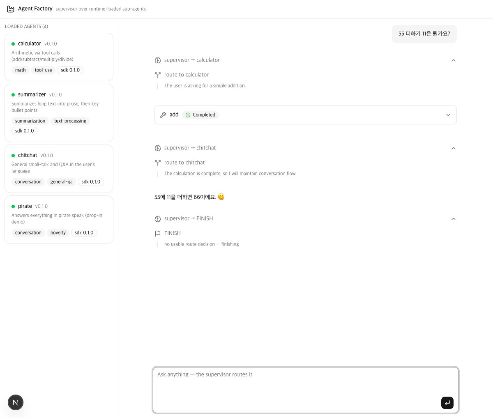
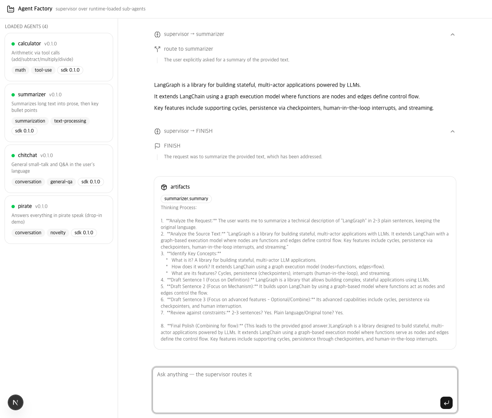
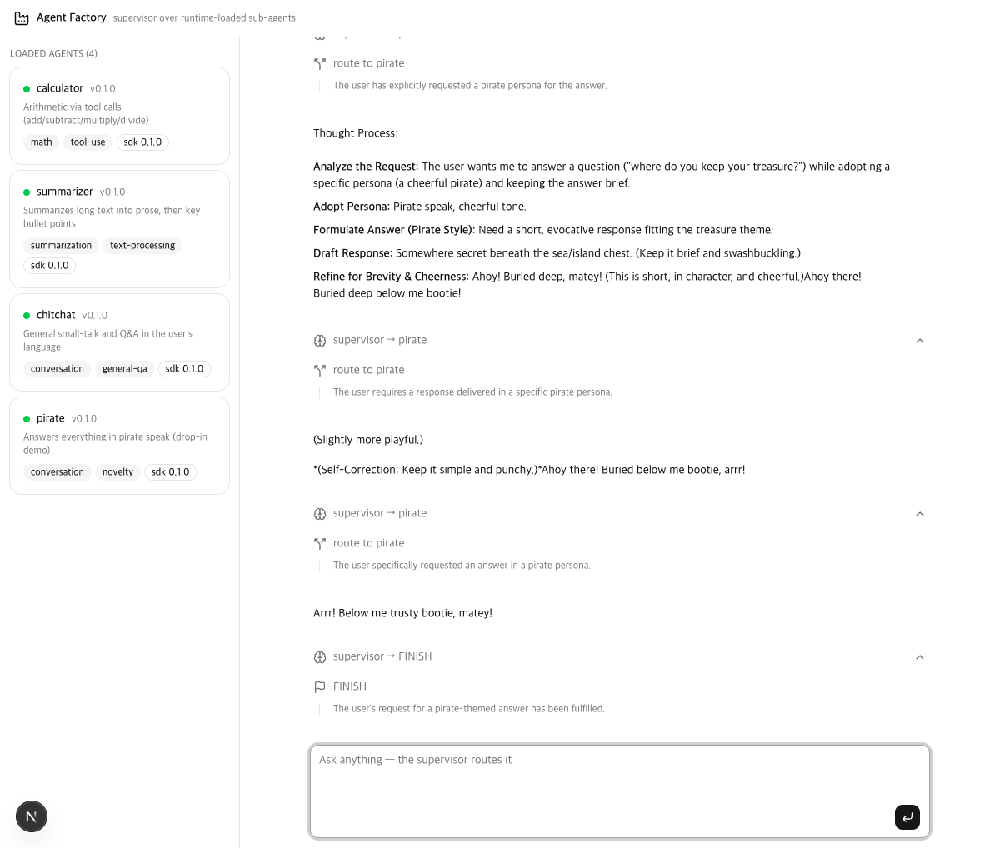

<div align="center">

# jyje/pilot-agent-factory

🏭 Pilot project for standardized, runtime-loadable LangGraph sub-agent packages

[](https://github.com/jyje/pilot-agent-factory)
[](LICENSE)
[](https://github.com/langchain-ai/langgraph)
[](https://www.python.org)

[English](README.md) · [한국어](README-ko.md) · [Docs](docs/README.md)

---

**Found this useful? Please give it a ⭐ — it helps others find it.**

</div>

## Overview

A pattern for developing LangGraph sub-agents as **standardized plugin packages** and loading them at runtime — without the host knowing them at build time.

```
Contract (SDK)  →  Packaging (entry points)  →  Runtime loading  →  Supervisor assembly
   Phase 1            Phase 2                      Phase 3            Phase 4
                                                          Phase 5 (planned): zip/tar/git import
```

Every sub-agent is a pip package that exposes a `manifest` (metadata + routing hints) and a `build()` factory returning a compiled `StateGraph`. The host discovers agents through two modes:

- **Mode A — entry points**: pip-installed packages registered under the `agent_factory.agents` group (default)
- **Mode B — drop-ins**: plain `.py` files imported from a directory at runtime (the local stand-in for a mounted PVC/ConfigMap)

One broken agent never blocks the host: load failures are isolated and reported per source. The Phase 4 supervisor then assembles whatever loaded into one multi-agent graph — `capabilities` drive the routing prompt, `output_schema` drives state mapping, `name@version` drives trace tags.

```
        host (main.py chat · app/backend · web app)
                         │ discover
            ┌────────────┼─────────────┐
            ▼            ▼             ▼
     entry points   entry points    dropins/*.py
    agent-chitchat  agent-calculator  agent_pirate.py
    agent-summarizer        │
            └────────────┬──┘
                         ▼
   supervisor ⇄ adapters over SubAgent.build(config)
```


## Demo — live scenarios on a local model

All captured against LM Studio (`google/gemma-4-e4b`) through the web console. The route chips between messages are the supervisor's actual decisions (`route_trace`), streamed over SSE.

### 1 · Cross-agent collaboration (Korean math)

*"55 더하기 11은 뭔가요?"* — the supervisor routes to **calculator** (runs the `add` tool), then hands off to **chitchat**, which answers naturally in Korean ("55에 11을 더하면 66이에요 😊") before FINISH. Two specialized agents cooperating on one request, with no orchestration code specific to either.



### 2 · Custom state channels (summarizer + artifacts)

A summarize request routes to **summarizer**, whose two-node pipeline returns bullet points as the reply *and* lifts its `summary` state channel into the supervisor's `artifacts` — visible as the 📦 card, exactly as declared in the agent's `output_schema`.



### 3 · Drop-in agent routing (pirate)

The **pirate** agent was never pip-installed — it's a single file in `dropins/`. The router still finds and picks it from its manifest capabilities. This run also shows the router's degradation path on a weak local model: it re-consults pirate before the routing-history hint pushes it to FINISH.



## What's inside

| Component | Role |
|---------|------|
| `src/packages/agent-factory-sdk` | Contract (`AgentManifest`, `SubAgent`), semver compat gate, loader/registry, **supervisor assembly**, test harness |
| `src/packages/agent-chitchat` | Example 1 — single-node conversational graph |
| `src/packages/agent-calculator` | Example 2 — ReAct tool loop (add/subtract/multiply/divide) |
| `src/packages/agent-summarizer` | Example 3 — two-node pipeline with a custom `summary` state channel |
| `src/dropins/agent_pirate.py` | Mode B demo — loaded from a file, never pip-installed |
| `app/backend` | FastAPI consumer of the platform — `/api/agents`, `/api/chat` (SSE) |
| `app/frontend` | Next.js 16 + AI Elements + shadcn/ui supervisor console |

## Quick Start

Runs fully local against [LM Studio](https://lmstudio.ai)'s Anthropic-compatible endpoint — no API key needed.

```bash
git clone https://github.com/jyje/pilot-agent-factory.git
cd pilot-agent-factory/src
cp .env.sample .env   # defaults to LM Studio at http://127.0.0.1:1234

uv sync --dev

# verify: env, endpoint, agent discovery, inference
uv run python doctor.py

# list discovered agents (3 installed + 1 drop-in)
uv run python main.py list

# run one agent directly, or let the supervisor route
uv run python main.py run calculator "What is (17 + 25) * 3?"
uv run python main.py chat "What is (17 + 25) * 3?"

# LLM-free test suite (contract + loader + agents + supervisor)
uv run pytest
```

### Web app (supervisor console)

```bash
# terminal 1 — backend
cd app/backend && uv sync
uv run fastapi dev src/agent_factory_backend/server.py

# terminal 2 — frontend
cd app/frontend && pnpm install
pnpm dev      # → http://localhost:3000
```

→ Details: [docs/03-webapp.md](docs/03-webapp.md)

LM Studio setup: load a tool-use capable model (e.g. `google/gemma-4-e4b`) with context ≥16384, REST API v1 in Anthropic-compatible mode — see the [LM Studio guide](https://github.com/jyje/pilot-deepagents-rubrics/blob/main/docs/05-lmstudio.md) from the sibling pilot. Switching to the official Anthropic API is a `.env`-only change.

## Documentation

→ [docs/README.md](docs/README.md) — architecture, contract spec, and how to write a new agent

## License

MIT © [jyje](https://github.com/jyje)
