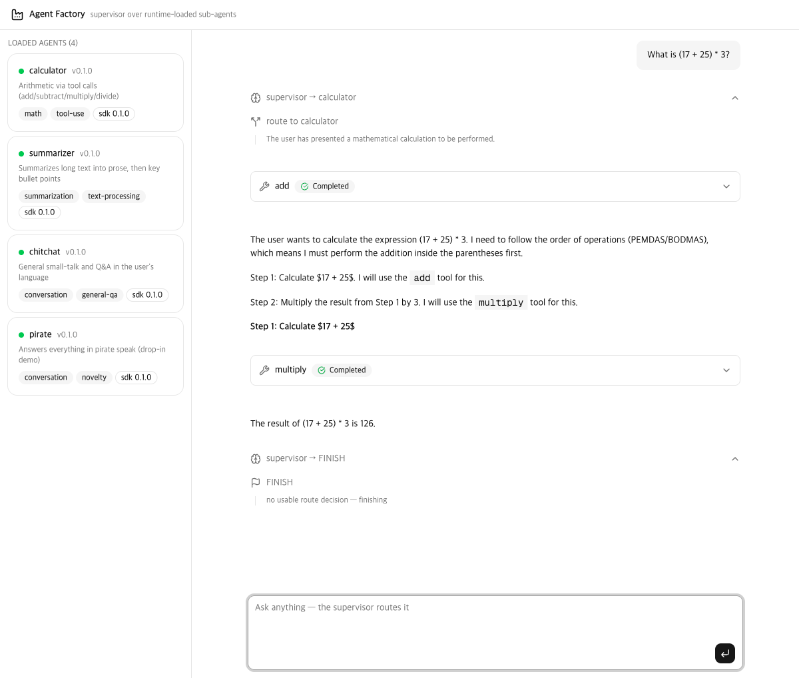

# Web App — Supervisor Console

> [한국어](03-webapp-ko.md)



The `app/` directory is the platform's **first external consumer**: a FastAPI backend and a Next.js frontend that depend on the `src/` packages the same way any other service would (path dependencies today, a private index in Phase 5).

```
app/
├── backend/    FastAPI — /api/agents, /api/chat (SSE)
└── frontend/   Next.js 16 + AI Elements + shadcn/ui
```

## Backend (`app/backend`)

```bash
cd app/backend
uv sync
uv run fastapi dev src/agent_factory_backend/server.py    # dev, auto-reload
# or: uv run uvicorn agent_factory_backend.server:app --port 8000
```

| Endpoint | Description |
|---|---|
| `GET /api/agents` | loaded manifests + isolated load failures (the Phase 3 registry, over HTTP) |
| `POST /api/chat` | runs the deep supervisor (Phase 5; `SUPERVISOR_MODE=simple` for the Phase 4 router); takes `session_id` for multi-turn threads; streams SSE events `route` / `message` / `artifacts` / `done` / `error` |
| `GET /api/graph` | Mermaid platform overview (supervisor + every agent's compiled graph) |
| `GET /api/graph/top` · `/api/graph/{name}` | top-level graph / one agent's graph |
| `/` | serves `app/frontend/dist` when a static export exists |

Sessions are held in an in-process `MemorySaver` checkpointer keyed by `session_id` — they reset when the backend restarts.

### SSE event protocol (`POST /api/chat`)

| Event | Payload | Notes |
|---|---|---|
| `token` | `{agent, text}` | incremental LLM text; `agent` comes from the trace metadata on sub-agent runnables (`subgraphs=True` streaming), `"supervisor"` for the top model |
| `route` | `{next, reason}` | Phase 4 router decisions (simple mode only) |
| `message` | `{role, name, content, reasoning, tool_calls}` | finalized top-level message; `reasoning` is model thinking split out server-side (`<think>` tags or "Thought/Thinking Process:" narration); empty-reply artifacts (`[]`) are dropped |
| `notice` | `{detail}` | non-fatal turn problem (e.g. the model produced no answer) — the UI offers a retry |
| `artifacts` / `done` / `error` | — | unchanged: lifted state channels / turn end (`session_id`, `hops`) / fatal error |

Environment resolution: local `.env` first, then falls back to `src/.env` (so the LM Studio setup is shared). Drop-in directory defaults to `src/dropins`, overridable via `AGENT_DROPINS`.

## Frontend (`app/frontend`)

```bash
cd app/frontend
pnpm install
pnpm dev        # http://localhost:3000 (expects backend on :8000)
```

`pnpm-workspace.yaml` pre-approves the two build scripts pnpm would otherwise block (`sharp`, `unrs-resolver`).

Component policy (per project convention):

- **AI Elements** for all conversational UI: `Conversation`, `Message`/`MessageResponse`, `PromptInput`, `Tool`, `ChainOfThought`, `Reasoning` (thinking fold — streams open, auto-collapses to "Thought for N seconds" when the stream ends).
- **shadcn/ui** for everything else: `Card`, `Badge`, `Separator`, `ScrollArea`.
- **`src/components/custom/`** wraps the two when our domain needs a shape they don't ship: `AgentCard`/`LoadErrorCard` (manifest + Phase 3 failures), `RouteStep` (supervisor decisions on ChainOfThought), `ToolCall` (our SSE tool events on the Tool part shape), `ArtifactsCard` (lifted state channels), `GraphDialog`/`MermaidDiagram` (graph structure rendered with the `mermaid` package — header **Structure** button or any agent card), `ChatMessage` (agent badge + reasoning fold + streaming pulse per bubble), `ActiveAgentIndicator` (who is generating right now), `NoticeCard` (empty-reply notice with one-click retry).
- `src/hooks/use-supervisor-chat.ts` parses the backend's SSE into a renderable timeline: `token` events accumulate into per-agent live bubbles, finalizing `message` events swap in the cleaned content + reasoning, tool calls pair with their results, and sub-agent bubbles (which never get a top-level finalizer) settle via the client-side reasoning splitter on agent handover or `done`.

`NEXT_PUBLIC_API_BASE` overrides the backend address (default `http://127.0.0.1:8000`).

### Note on vendored AI Elements

AI Elements components are vendored (shadcn model — you own the code). The installed shadcn generation uses **Base UI** primitives while some AI Elements code still expects the Radix API; the deltas are patched in place and marked with comments (hover-card delay props, two event handler types). Unused components were removed; re-add any with `npx ai-elements@latest add <name>`.
