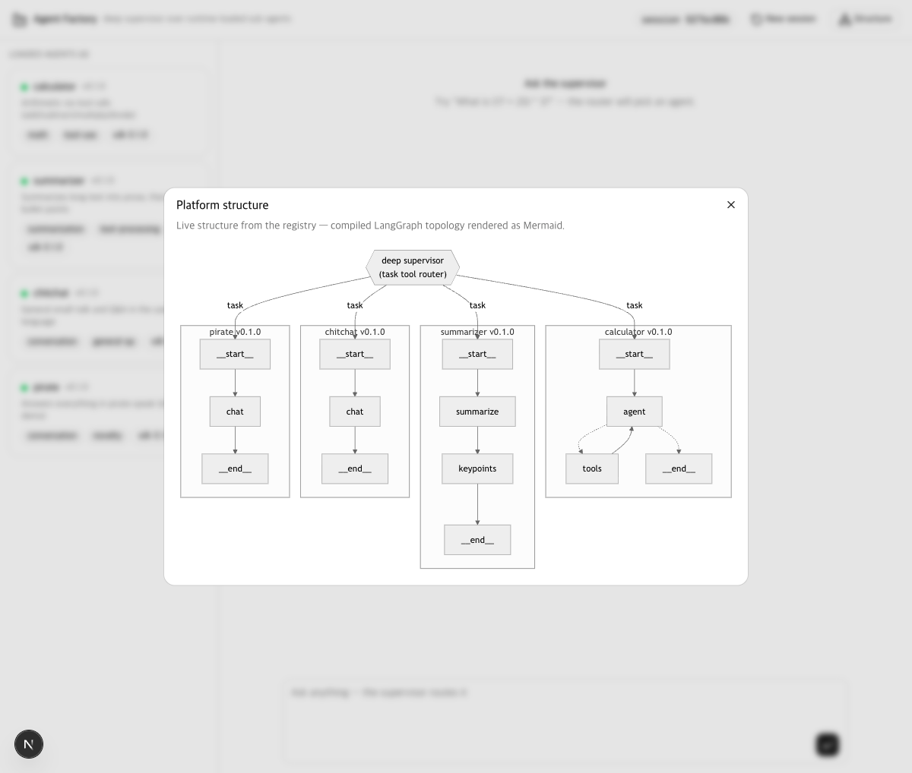
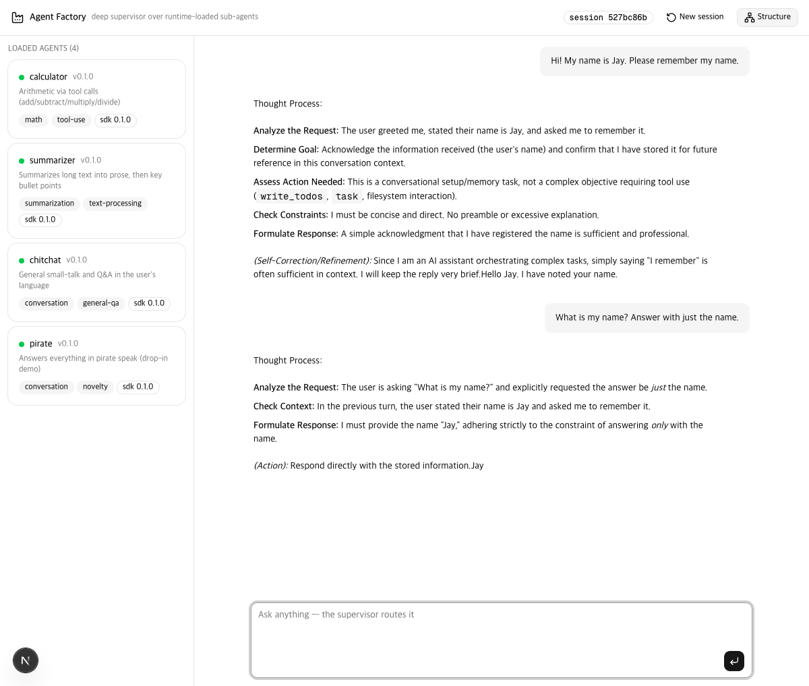
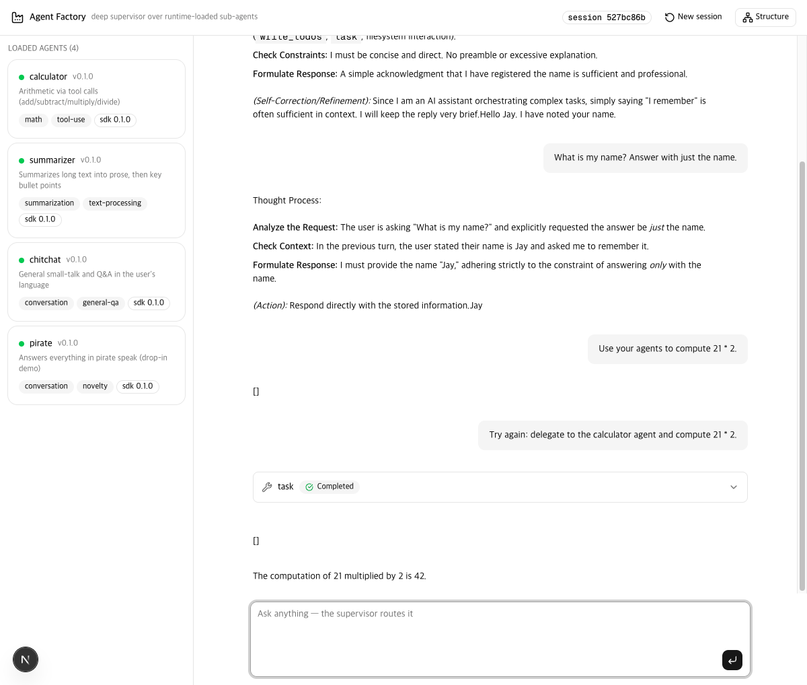

# Phase 5 — Deep Agent 오케스트레이션

> [English](04-phase5-plan.md) · 상태: **구현 완료**
>
> 선회 메모: Phase 5는 원래 zip/tar/git import 파이프라인으로 계획됐습니다.
> 그 작업은 **Phase 6 (계획)** 으로 이월했습니다 — 문서 하단 참조.
> 대신 Phase 5는 [deep agent](https://docs.langchain.com/oss/python/deepagents)를
> 스택 최상위에 두고, 구조 가시성을 더하고, 대화를 멀티턴으로 만듭니다.

## 무엇이 바뀌었나

```
Phase 4                              Phase 5
─────────                            ─────────
수제 라우터 (route 툴)            →   최상위 deepagents (task 툴, todos, 요약)
단발성 대화                       →   checkpointer 세션 (thread_id)
구조는 코드에만 존재              →   CLI/웹의 Mermaid 그래프 뷰
```

`agent_factory_sdk.deep`의 `build_deep_supervisor(registry, config, checkpointer)`가
런타임 로딩된 동일한 에이전트들을 — 변경 없이 `CompiledSubAgent`로 —
`create_deep_agent` 아래에 조립합니다. Phase 4의 `build_supervisor`도 유지됩니다
(CLI `--simple`, `SUPERVISOR_MODE=simple`).

## 1 · 최상위 deep agent, 파일시스템 미연결

- 레지스트리 에이전트가 deepagents `CompiledSubAgent`가 됩니다: manifest의
  `description` + `capabilities`가 `task` 툴의 위임 힌트가 됩니다 —
  Phase 4 라우터가 쓰던 것과 같은 필드입니다.
- 프로세스 전역 `HarnessProfile`(`anthropic` 프로바이더로 등록 — Anthropic 호환
  엔드포인트 뒤의 LM Studio 포함)이 파일시스템/샌드박스 툴 표면 전체를 숨깁니다
  (`ls`, `read_file`, `write_file`, `edit_file`, `glob`, `grep`, `execute`).
  deepagents ≥0.6.8은 `FilesystemMiddleware`를 필수 스캐폴딩으로 취급하므로
  미들웨어 제거가 아닌 툴 단위 차단입니다 — 기능적으로 동일하게, 모델은
  파일시스템 툴을 보거나 호출할 수 없습니다.
- 자동 추가되는 `general-purpose` 하위 에이전트를 비활성화해, **실제 작업의
  유일한 경로는 레지스트리의 하위 에이전트**입니다.

## 2 · 구조 가시성

| 표면 | 명령 / 엔드포인트 | 보여주는 것 |
|---|---|---|
| CLI | `uv run python main.py graph` | 플랫폼 오버뷰: 수퍼바이저 + 모든 에이전트의 실제 내부 그래프를 Mermaid 서브그래프로 |
| CLI | `main.py graph <agent>` / `--top` | 에이전트 하나의 컴파일된 그래프 / deep agent 자체 런타임 그래프 |
| API | `GET /api/graph`, `/api/graph/top`, `/api/graph/{name}` | 같은 3개 범위를 JSON `{scope, mermaid}`로 |
| 웹 | 헤더 **Structure** 버튼 · 에이전트 카드 클릭 | 다이얼로그에서 Mermaid 클라이언트 렌더링 |

오버뷰(`render_platform_mermaid`)는 손으로 그린 그림이 아니라 각 에이전트의
*컴파일된* 그래프 토폴로지에서 생성됩니다 — import된 에이전트도 그리기 코드
없이 실제 노드·엣지 그대로 나타납니다.



## 3 · 멀티턴 세션

두 수퍼바이저 모두 LangGraph `checkpointer`를 받으며, 대화는 `thread_id`로
구분됩니다:

- **API**: `POST /api/chat`이 `session_id`를 받습니다. 백엔드가 `MemorySaver`를
  유지하며 스레드의 기존 이력 이후 늘어난 부분만 스트리밍합니다.
- **웹**: 세션 칩 + **New session** 버튼. 페이지가 대화당 세션 id 하나를 유지합니다.
- **CLI**: `main.py chat`을 프롬프트 없이 실행하면 단일 스레드 REPL이 열립니다.

LM Studio 실기 검증: 턴 1 "My name is Jay" → 턴 2 "What is my name?" →
*"Jay"* (모델이 이전 턴을 인용), 이어서 같은 세션에서 calculator로 `task` 위임.




## 알려진 한계

- `MemorySaver`는 인프로세스: 서버가 죽으면 세션도 사라집니다. 필요 시 내구성
  checkpointer(SQLite/Postgres)로 바로 교체 가능합니다.
- 작은 로컬 모델은 deep agent 드라이버로는 변동이 있습니다: 가끔 빈 응답(`[]`)을
  내거나 위임을 건너뜁니다. 재프롬프트로 해결되며 모든 경로가 안전하게
  완화됩니다. Claude급 모델에서는 나타나지 않는 현상입니다.
- deep agent 자체 런타임 그래프(`graph --top`)는 미들웨어 루프를 보여줘 정확하지만
  가독성은 떨어집니다 — 의도된 기본값은 플랫폼 오버뷰입니다.

## Phase 6 (계획) — 배포 & import

이전 Phase 5 계획을 그대로 이월합니다: 패키지 컨벤션(`agent_factory.agents`
entry point 하나를 가진 `pyproject.toml`)을 따르는 zip/tar 아카이브와 git
저장소에서 에이전트를 import — 검증 게이트(의존성 밴드, 서브프로세스 격리),
버전별 설치 디렉토리, `agents.lock` 고정, 예시 저장소
`jyje/pilot-agent-template` 포함. 이번 단계의 그래프 오버뷰가 import 검증
뷰를 겸합니다: 갓 import된 에이전트가 그 그림에 즉시 나타나야 합니다.
